# Attendance System with Face Recognition

## Introduction

Attendance Management keeps track of your employee or students present/absent details. It is the system to document the time your employees/students work and the time they take off.

 In this digital era, face recognition system plays a vital role in  almost every  sector. Face recognition  is one  of the mostly used biometrics. It can used for security, authentication, identification.

This is an artificial intelligence based attendance management system with face recognition technology. The main objective of this AI based software solution is to update attendance with employees' face using computer vision.

This project can be divided into two main sub-systems. Attendance receiver module also called as face scanner (Written in Python) for reading and updating attendance to the database, and management module (Written in C#) for creating datasets of employees, training AI models with GUI, entering employees details and other management relented operations .


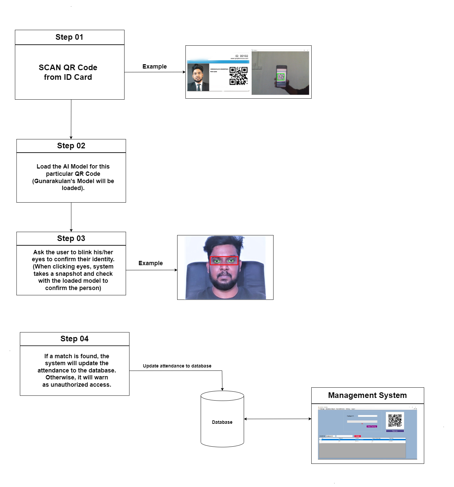


## Features

- Entering Attendances with time &  Leaving Attendances with time.
- First time it will update the entering attendance.
- Second time, it will update leaving attendance.
- Do not need to touch the device, the attendance can be done with face.
- Training can be done with a single click.
- It has a dataset creation module, where system can collect images of new employee.
- An easy approach management panel.
- Unauthorized access detection and prevention.
- Voice outputs
- Eye should be blinked to confirm the identify, this prevents digital image faking attack.


## Technologies & Frameworks  

#### Attendance Receiver - Face Scanner (Python)

- Python 3.6 - Main programming language.
- OpenCV - for computer vision.
- Face_Recognition module
- Pyzbar module - for scanning QR code.
- PYTTSX3 - a module for voice outputs.
- Playsound - a module for playing external sounds.
- mysql module - for database management
- pickle module - store trained data as pickle file.

#### Management Panel (CSharp)
- C# - Main programming language
- MySQL - Database.


### Setup Management Panel (CSharp)

#### Step 01:
  - Create an empty database in MySQL panel with name of **"management_auto_attendance_system"**.

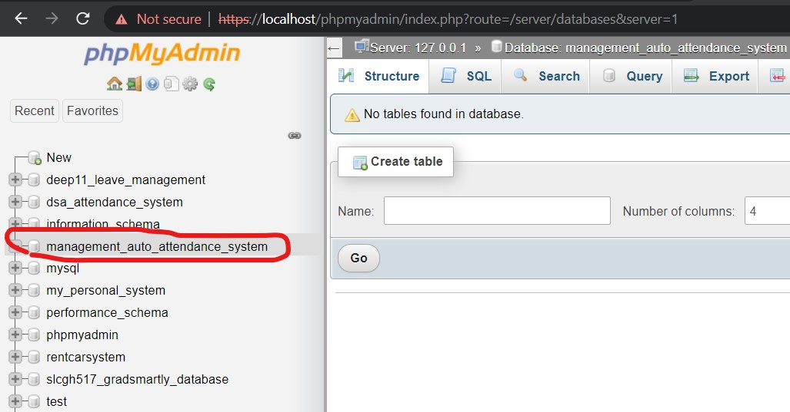

#### Step 02:

  - Import into that empty database with a SQL database that is found on following folder of this repository **(attendance-system-with-face-recognition/1-database)**.


  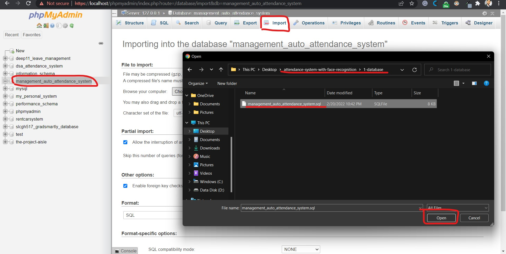


### Setup Attendance Receiver - Face Scanner (Python)

The attendance receiver is the main script that takes attendances from employees and store in the database. This module handles OR code detection, face recognition processes.

Setting up this attendance receiver is a bit tricky one since it contains many dependencies and framework installation.

**Note:** We need to install all dependencies in a Python virtual environment in order to connect the management panel (C#) and attendances receiver (Python) properly. The virtual environment name must be **ai_attendance_system_env**. Because, the management panel (C#) listens for environment that has the name of **ai_attendance_system_env**.

### Create a Python virtual environment with the name of (ai_attendance_system_env)

In this step, a python virtual environment needs to be created in order to setup the attendance receiver (Face Scanner) module. There are many environment management tools available such as Venv, Anaconda, Virtualenv and etc. Here, we are going to use the Anaconda Python distribution tool to manage environments and packages installation. Because, Anaconda usually use for advanced data science purpose.

#### Step 01:

  - Install Anaconda Python distribution.

  

Anaconda is a distribution of the Python and R programming languages for scientific computing (data science, machine learning applications, large-scale data processing, predictive analytics, etc.), that aims to simplify package management and deployment.

In order to install the Anaconda distribution, please checkout the official website for the instructions (https://www.anaconda.com/).

Download Anaconda: https://www.anaconda.com/products/individual

Anaconda installation tutorial: https://www.youtube.com/watch?v=RYSNnp5V7ps&t

Anaconda Documentation: https://docs.anaconda.com/

#### Step 02:


##### Easy setup

**NOTE :** If you want to setup the environment easily without installing dependencies one by one manually, run the **environment.yml** file using the bellow command. If setup the environment using bellow command, you don't need to follow the step 04 instructions.  

```cmd
  conda env create -f environment.yml  
```

##### Manual setup

 - Create a virtual environment using Anaconda.

At its core, the main purpose of Python virtual environments is to create an isolated environment for Python projects. This means that each project can have its own dependencies, regardless of what dependencies every other project has.

  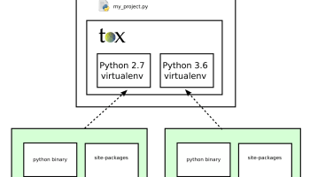

- Enter the bellow command in Terminal/CMD after the successful installation of Anaconda.

```cmd
 conda create -n ai_attendance_system_env python=3.6
```

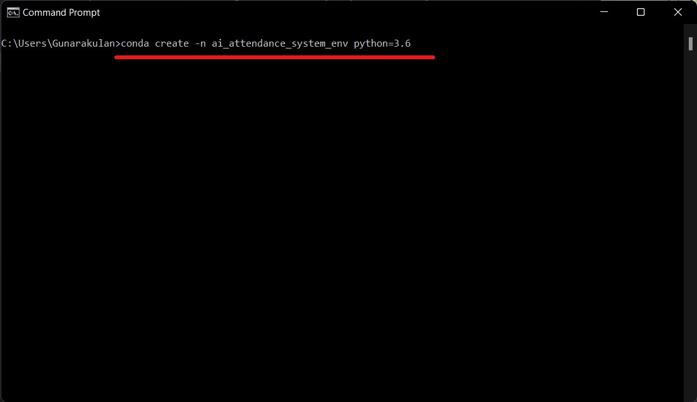

At this point, we are creating a virtual environment with the name of "ai_attendance_system_env" and this environment is using python 3.6.

**Note 1:** The environment name must be "ai_attendance_system_env".


#### Step 03:
  - Activate the "ai_attendance_system_env" environment.

  ```cmd
    conda activate ai_attendance_system_env
  ```
  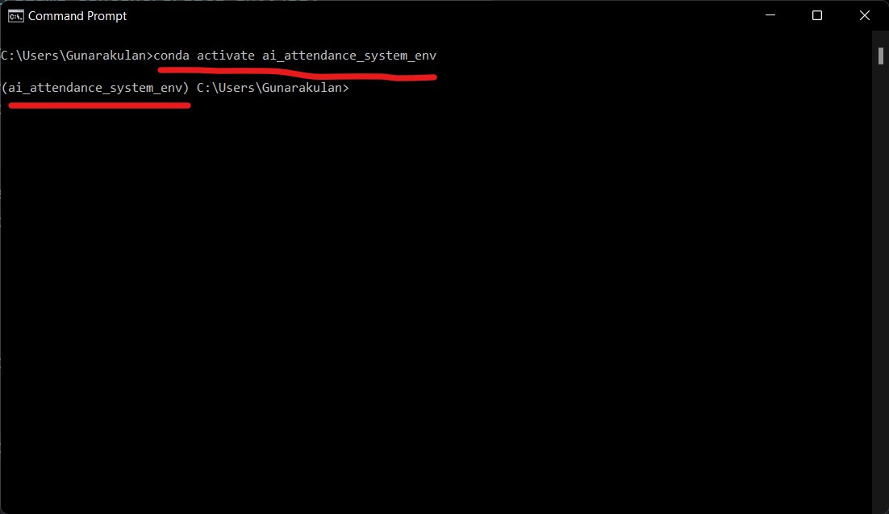


**Note:** After the activation, If we install a dependency, it will be installed under this environment.

#### Step 04:

- Install the following dependencies on the "ai_attendance_system_env" environment (Python 3.6).


```cmd
  pip install opencv-python
```

```cmd
  pip install pyttsx3
```

```cmd
  pip install cmake
```

```cmd
  pip install face_recognition
```

```cmd
  pip install imutils
```

```cmd
  pip install playsound==1.2.2
```

```cmd
  pip install mysql-connector-python
```


```cmd
  pip install qrcode
```


**Note:** These are the important dependencies of the attendance receiver (Python) module. These dependencies must be installed  under the "ai_attendance_system_env" environment.

**IMPORTANT NOTE 1:** When you install a dependency by using "pip install", it will install the latest version of the dependency. Sometimes, we need the exact version that is used in the project. **To find the dependencies' version, please check out 'required-dependencies.txt'** that is found on the project folder.


**IMPORTANT NOTE 2:** If you are setting up this project in a virtual environment, the environment can be easily setup using the **environment.yml** file using the bellow command.

```cmd
  conda env create -f environment.yml  
```

### Explained main python scripts of this project.

There are 3 main python scripts that are the backbone of this project.

- dataset-creator.py
- training.py
- run.py


The scripts are found on the following directory

```cmd
  attendance-system-with-face-recognition\0-management-auto-attendance-system\Management_Auto_Attendance_System\bin\Debug
```

  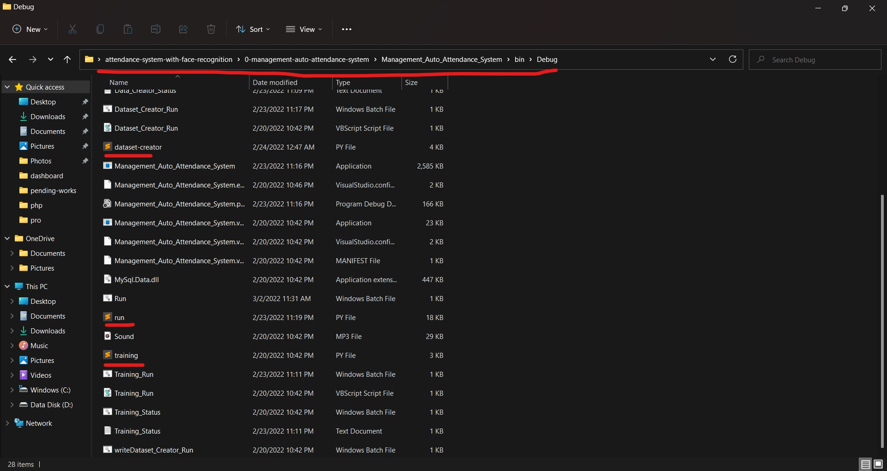

#### 01. dataset-creator.py script explained

A Python script for creating employees' face dataset for training. This script is written in Python and, it is used to take snapshots of employees' face and generate dataset from it.

**Note:** This script is executed (trigger) from the C# management panel whenever the admin register employees into the database.


#### 02. training.py script explained

A Python script for training face recognition models for employees. After the dataset has generated. Now, it's time to train the face recognition model for that registered employee. For this task, training.py script will be used.

**Note:** This script is executed (trigger) from the C# management panel. There is a sub-module in management panel (C#) called "Training", we can simply train a machine learning model with a single click. When training happens, this Python script is execute by C# management panel.

#### 03. run.py script explained

The main Python script that does the attendance receiving process. This script is huge, because,  this script acts as the attendance receiver module. This single file contains many functions such as QR-code scanning, eye-blinking detection & face verification, updating attendance in the database and etc.

**Note:** This script could be run manually. There is a run.bat file in the project folder where we can click that file and execute to the attendance receiver module.


### Explained Attendance Receiver

Attendance receiver is the main module that takes attendance (Python) and update to the database. Then, the database is maintained and managed by the management panel(C#).

#### Features

- Scan QR-Code and Validation.
- Load ML model of the scanned QR-Code.
- Eye-blinking detection & face verification.
- Update attendance to database.


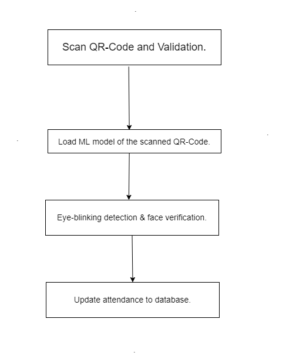


To run (execute) the attendance receiver, please open the following batch script that is found the following directory.

```cmd
  attendance-system-with-face-recognition\0-management-auto-attendance-system\Management_Auto_Attendance_System\bin\Debug\run.bat
```


This module updates attendance to the database after completing these procedures. Scan QR code, blink eyes.

**Note 1:** If the user presses the (Space bar) key during the face verification part, the system will be restarted, and begin from QR-Code scan section. This is implemented to avoid some confliction in the project.   

**Note 2:** If the user presses the (Enter) key during the face verification part, the system will ignore the face verification part and update attendance as present in the database. The reason why it is implemented, errors happens always in computer vision and machine learning applications. Sometimes, It is not able to recognize the employee face due to some issue like lighting, with facial hair, insufficient face images and etc. To avoid these types of issue, the user can pass out after QR-Code scan by pressing the enter key during the face verification part. This feature will be removed in future versions once, the system has the capable to recognize face more accurately. If a user pass out via pressing the "Enter" key, the attendance will be updated in NOT FACE VERIFIED mode, then the system admin will show that face manually in the Management System (C#) and verify the face.

### Explained Management Panel (C#)

The management panel (C#) is the key component, that handles the database and management part of the system.

The database setup has been already finished in the above section (Setup Management Panel C#).

#### Features

- Insert Employees
- Edit Employees data
- Create dataset of employees face
- Train AI model with single click
- Analyze & manage attendance data

#### Credentials
- Username: **admin**
- Username: **kuna123**

#### Splash Screen

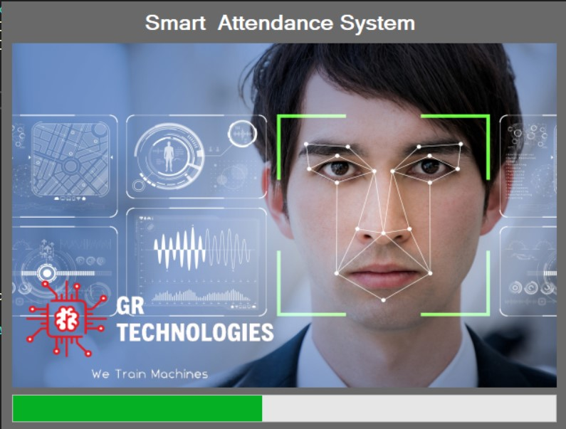

The splash screen is the loading screen of the management system.


#### Login Screen

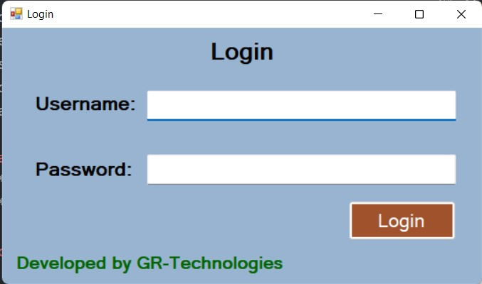

The login screen is the authentication section of the management system. Currently, this module has only admin account.

##### Credentials
- Username: **admin**
- Username: **kuna123**


#### Dashboard


The management panel dashboard is the central are of all features' accesses and usages.

##### Dashboard Structure

- Manage
  - Manage Employees
    - Insert Employees
    - Modify Employees
  - Create Dataset
  - Training
- Attendance Report
- Face Verification
- Settings
- Logout

#### Manage Employees (Insert Employees Module)

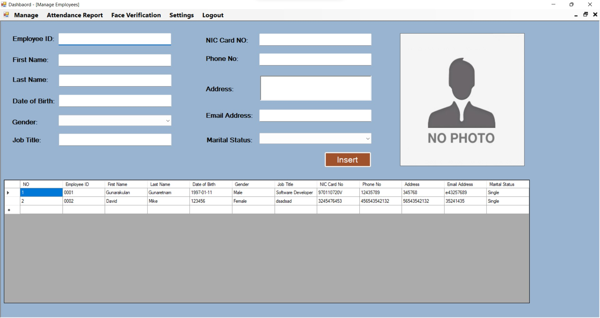

The main function of this module is to register employees to the database. The system admin needs to enter some basic information of an employee including a headshot photo.

##### Features

- Insert employees details
- Add headshot photo

#### Manage Employees (Modify Employees Module)

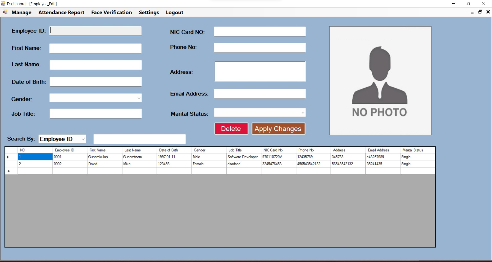

This main function of this module is to update/edit employees' details in the database. It also has function to delete employees.

##### Features

- Edit employees details
- Delete employees
- Search employees by Employee ID, NIC Card No, First Name, Phone Number.  

#### Create Dataset

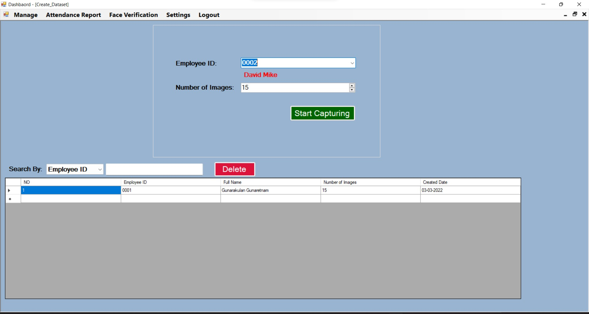

This module is responsible for creating & managing datasets of employees' face. It lists out all the employees' ids in the first dropdown select box who DOES NOT have dataset.

From the second select box, the admin needs to set the number of image samples that is needed for the model training.

After selecting the employee ID and number of images, the admin will click the "Start Capturing" green button, then a Python script will be trigger by the C# with the help of a Batch script to take employees' face sample images to train a machine learning model for face recognition task.

The bellow table shows up all the datasets that are already been taken. The admin can delete a dataset using this module, and able search datasets using Employee ID, Full Name.

##### Features

- Create datasets
- Delete datasets
- Search datasets by Employee ID, Full Name


##### Image Capturing Process.

This Python script will be trigger when clicking the green "Start Capturing" button by the C# with the help of a batch script.


#### Training

The primary function of this module is to train a machine learning model for the face recognition task, of a particular employee with the captured face image samples.

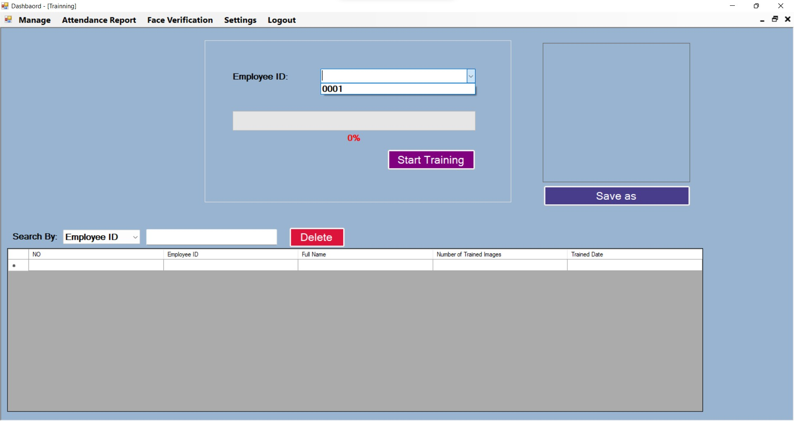

It lists out all the employees' ids in the first dropdown select box who DOES NOT have a face recognition machine learning model.

The admin will select an employee that needs face recognition model, and then the admin can simply click the "Start Training" button to begin the training process.

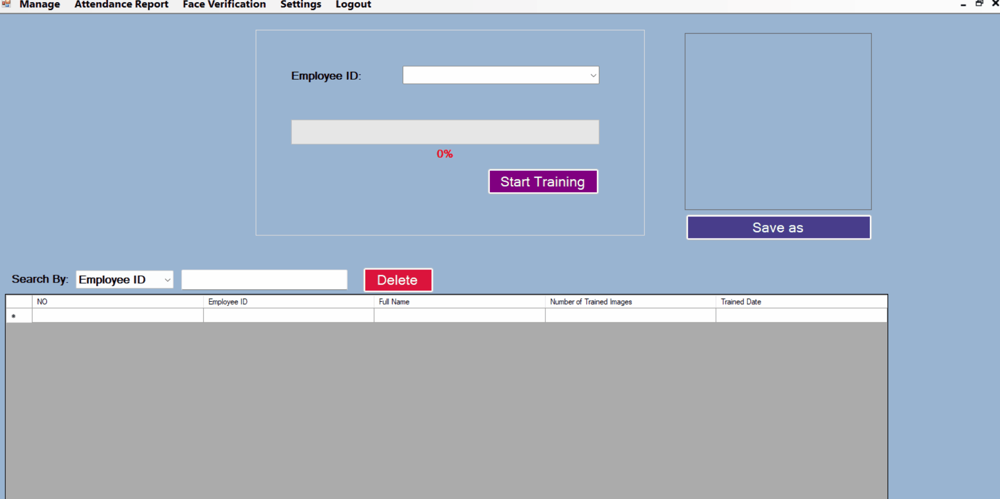

The bellow table lists out all the trained models, from there, the admin can delete or search ML model of a particular employee.


##### Generate QR Code

**Note:** After the training finishes, the system will automatically generate a QR-Code for that particular employee, this QR-Code will be printed in the employee's ID card.

The employee will show this QR-Code to load his model to verify his face by blinking his/her eyes to update the attendance record to the database.


##### Features

- Single click model training.
- Generate QR code for the particular employee.
- Delete ML models.
- Search ML models using Employee ID, Full Name.


##### Training Algorithm

We are using 128d (FaceNet) face embeddings agriculture for model training process. During the training process, the it collects and organize 128d face embeddings in a vector, then those data are stored in a pickle format as a model to use later in the attendance receiver module when verifying faces.

FaceNet takes an image of the person’s face as input and outputs a vector of 128 numbers which represent the most important features of a face. In machine learning, this vector is called embedding. Why embedding? Because all the important information from an image is embedded into this vector. Basically, FaceNet takes a person’s face and compresses it into a vector of 128 numbers. Ideally, embeddings of similar faces are also similar.

Mapping high-dimensional data (like images) into low-dimensional representations (embeddings) has become a fairly common practice in machine learning these days

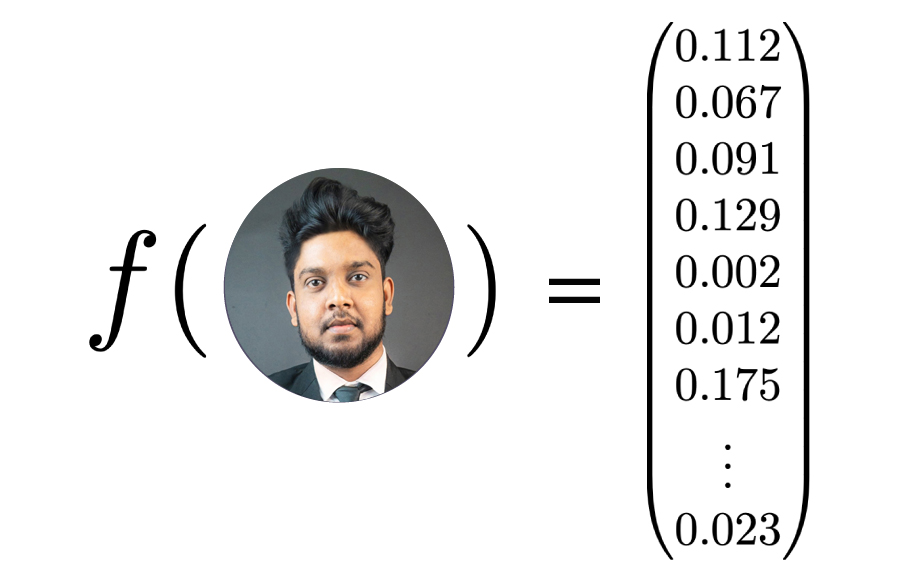


#### Attendance Report

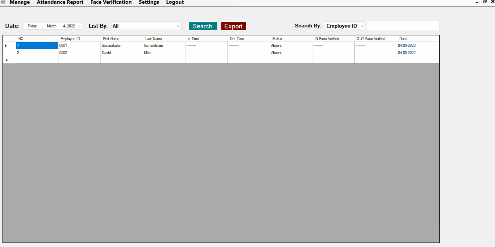

This module is the place where the attendance details are managed & maintained. It will show who are present on particular date.  

##### Features
- List all attendances data
- List all attendance based on a particular date.
- List all attendance based on status (Absent, Present)
- Export table data in Excel file.
- Good Filter and search options.


#### Face Verification


This module is used to avoid run time errors during face verification part. For an example,
if an employee’s face has not trained well, lighting issue or facial hair issue, the system will find difficult
to verify employee's face. Therefore, the employee would be unable to pass out
the attendance, to sort out this issue, the employee can skip the face verification
step via pressing the “Enter key”. However, the attendance will be marked as unverified
face in the database. Then, it will be reviewed by the system admin manually.

This module will list all the attendances that are not face verified. From this table, the system admin will manually verify the face.

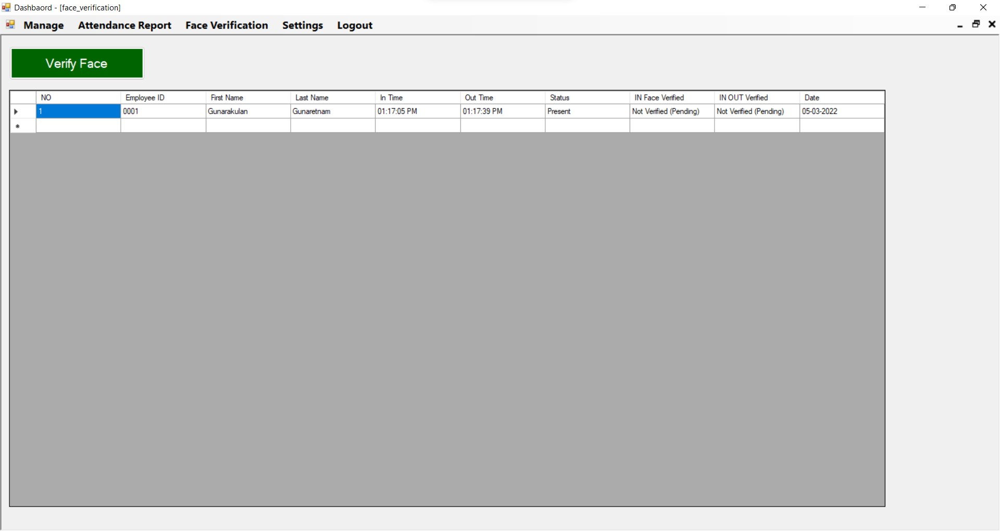

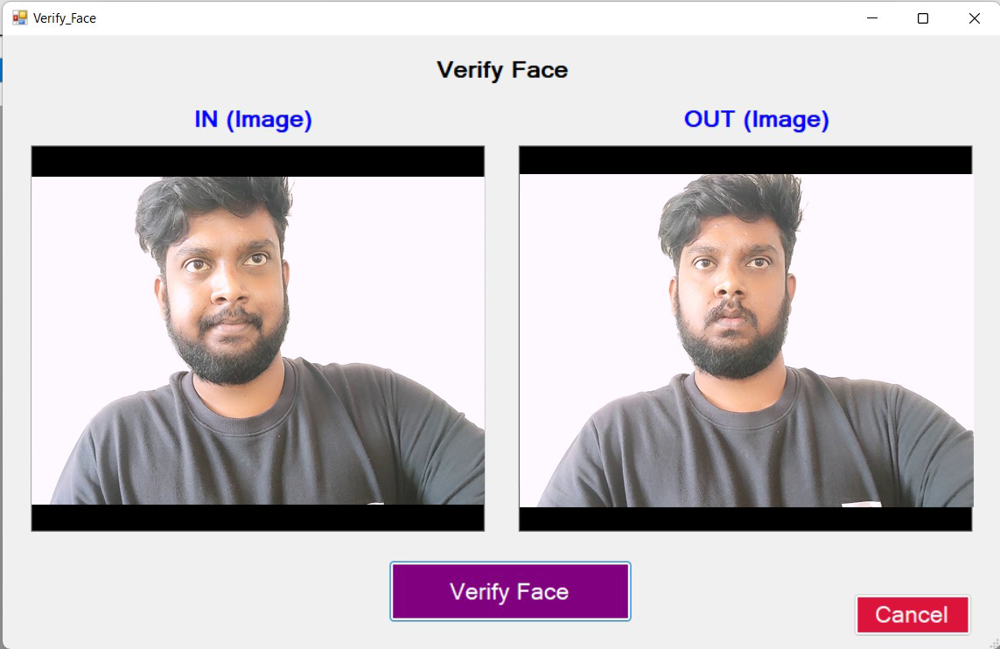

The system admin will see these images and manually verify them via clicking the "Verify Face" button.

##### Features

- Verify Face
- Show images

#### Settings

This module is the setting part of the system. From this module, the system admin can change the preferences.

##### Features

- Change username
- Change Password
- Turn on/off face verification

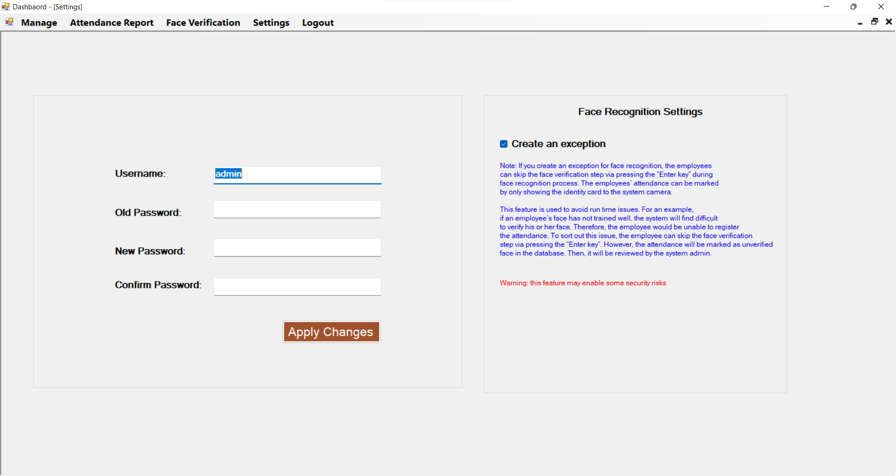


## Others & References

#### To change camera index in python script.

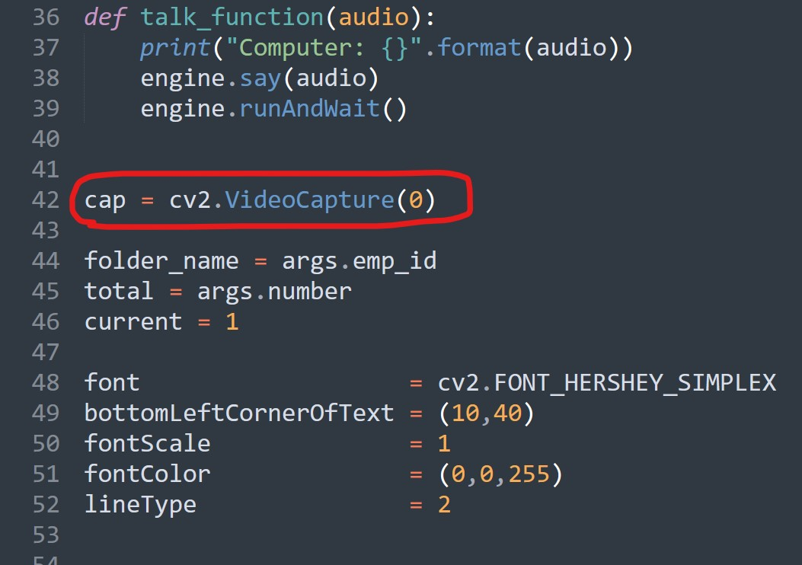

There are 2 main Python scripts that are using OpenCV, those are dataset-creator.py and run.py.

```python
  cap = cv2.VideoCapture(0)
```

The index "0" means, it is using the first attached camera of the computer/device, If the computer/device has more than 1 cameras, they can be switched by changing the index that means, 0 is first camera, 1 is second camera, 2 means third camera and etc.

If we're trying to run this application with a second camera, we should change these in dataset-creator.py and run.py Python scripts.

Social Media Links
---

* [Linkedin Profile](https://www.linkedin.com/in/gunarakulangunaretnam/)
* [Facebook Page](https://www.facebook.com/gunarakulangunaretnam)
* [Twitter Profile](https://twitter.com/gunarakulan)
* [Instagram Profile](https://www.instagram.com/gunarakulangunaretnam/)
* [Youtube Channel](https://www.youtube.com/channel/UCMWkED5sabgVZSCKjZuRJXA)
